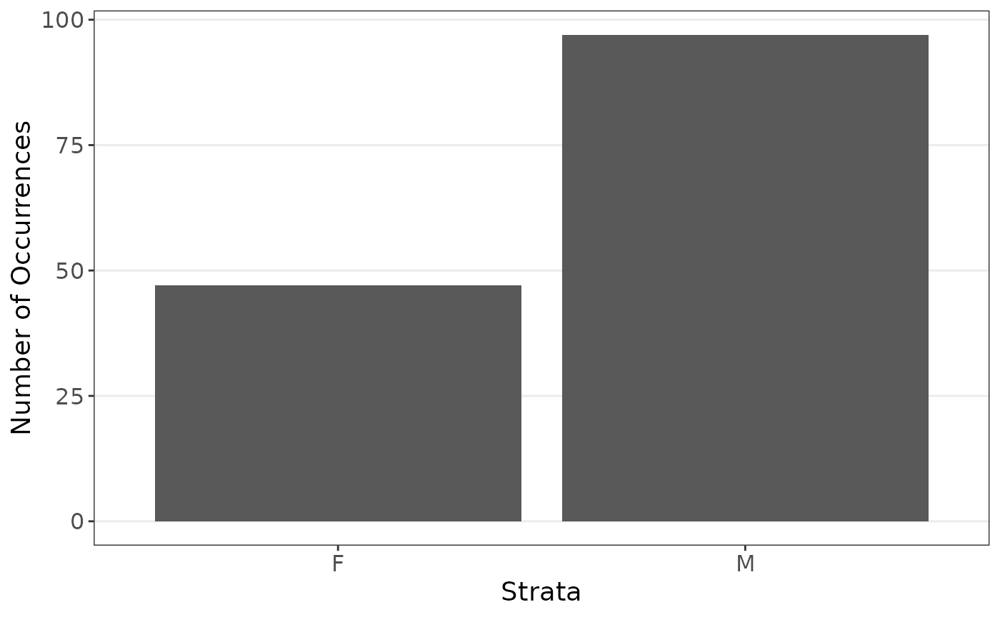
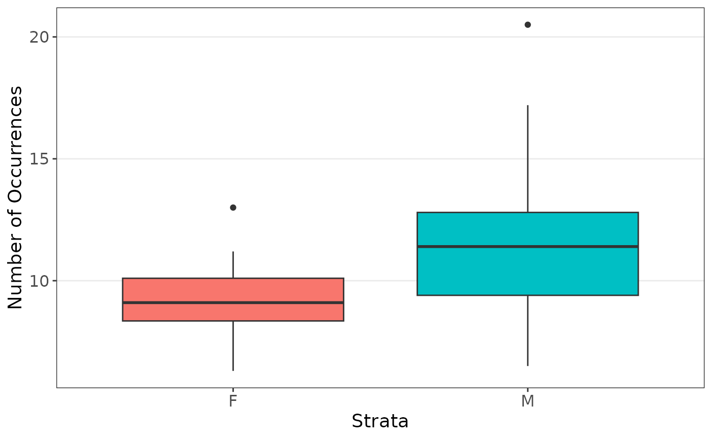
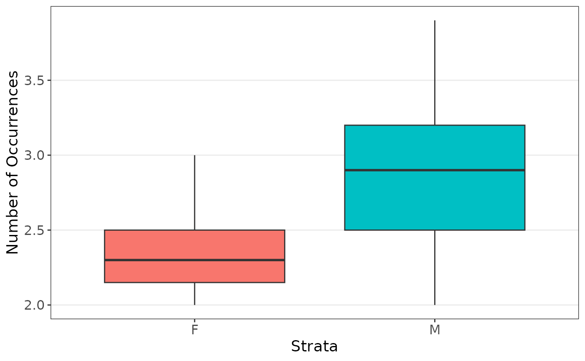
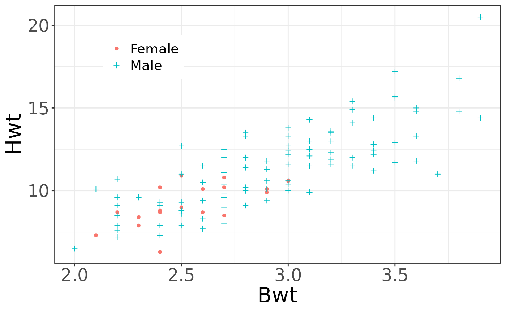
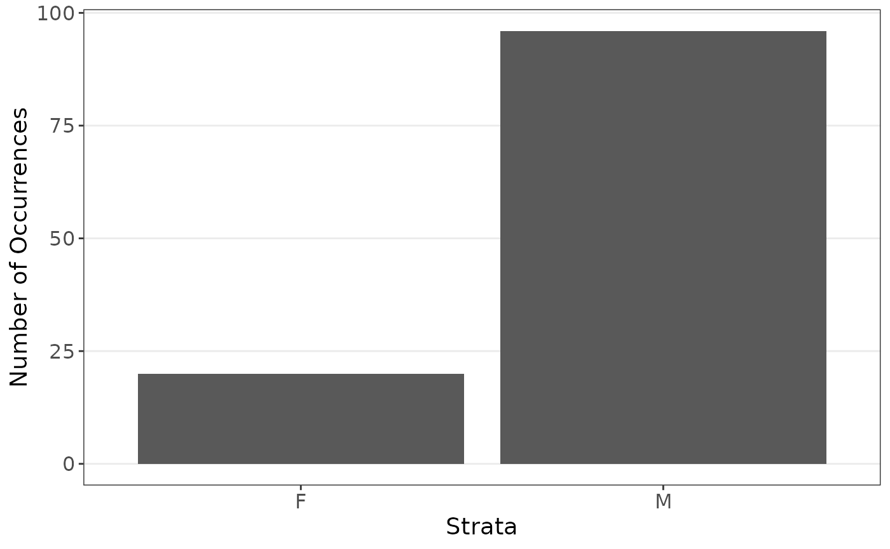

# cats

## Overview

This article examines data on cats, includes as *cats* and *subcats* in
the package. The goal of this analysis is to see the effect sex has on
the body and heart weight measures. This analysis goes further than that
in the purify article by adding cross-validation to the summary
function. This comes at the cost of computational time.

``` r

library(purify)
library(ggplot2)

summ_function <- function(data) {
  cv <- cross_validation(
    data = data,
    pred_fn = function(data, nd) {
      as.numeric(predict(lm(Hwt ~ ., data = data), newdata = nd))
    },
    error_fn = function(true, est) {
      mean((true$Hwt - est)^2)
    }
  )
  mod <- lm(Hwt ~ ., data = data)
  c(cv[[1]], as.numeric(coef(summary(mod))[, 1]))
}
```

## Full Data

We first are interested in the coefficients when estimating the body
weight using sex and heart weight, stratified on sex since there are far
less female cats observed.

``` r

plot_strata_bar(cats$Sex)
```



``` r

plot_strata_box(cats[, c("Sex", "Hwt")])
```



``` r

plot_strata_box(cats[, c("Sex", "Bwt")])
```



``` r


ggplot() +
  geom_point(aes(x = Bwt, y = Hwt, col = Sex, shape = Sex), data = cats, size = 5) +
  theme_bw() +
  theme(
    axis.title = element_text(size = 30),
    axis.text = element_text(size = 26),
    legend.position = c(.2, .8),
    legend.title = element_blank(),
    legend.text = element_text(size = 26)
  ) +
  scale_color_discrete(labels = c("Female", "Male")) +
  scale_shape_manual(
    labels = c("Female", "Male"),
    values = c(16, 3)
  ) +
  xlab("Body weight (kg)") +
  ylab("Heart weight (g)")
```



Now modeling the data:

``` r

set.seed(1234)
summ_function(cats)
#> [1]  2.18141845 -0.41495263 -0.08209684  4.07576892

# Perform resampling (with CV included so a bit time consuming)
results <- resample(
  data = cats, fn = summ_function, M = 500,
  strata = "Sex", sizes = function(x) round(mean(x))
)
summarize_resample(results)
#>     estimates        sd      lower     upper
#> V1 1.94170124 0.2396958  1.5219943 2.4252585
#> V2 0.09127577 0.9101625 -1.7096981 1.6920913
#> V3 0.04491171 0.2672944 -0.4863061 0.5720345
#> V4 3.86256391 0.3790560  3.2023760 4.6366714
```

In both methods, the sex was insignificant and body weight was
important.

## Subset Data

We are now interested in the coefficients when estimating the body
weight using sex and heart weight, stratified on sex since there are far
less female cats observed, with a smaller data set. In practice it is
hard to know the exact effect of data sizes, so it is worth examining
what may happen. We subset the data such that sex will now be more
important

``` r

plot_strata_bar(subcats$Sex)
```



Now modeling the data:

``` r

# Original model
set.seed(1234)
tmp <- lm(Hwt ~ ., data = subcats)
coef(summary(tmp))
#>               Estimate Std. Error   t value     Pr(>|t|)
#> (Intercept) -1.4861533  0.8831869 -1.682717 9.519112e-02
#> SexM         0.6167464  0.3812708  1.617607 1.085354e-01
#> Bwt          4.2078878  0.3204588 13.130823 1.760509e-24
confint(tmp)
#>                  2.5 %    97.5 %
#> (Intercept) -3.2359058 0.2635992
#> SexM        -0.1386197 1.3721126
#> Bwt          3.5730011 4.8427744

## CV for both
set.seed(1234)
results <- resample(
  data = subcats, fn = summ_function,
  M = 500, strata = "Sex"
)

cross_validation(
  data = subcats,
  pred_fn = function(data, nd) {
    as.numeric(predict(lm(Hwt ~ ., data = data), newdata = nd))
  },
  error_fn = function(true, est) {
    mean((true$Hwt - est)^2)
  }
)
#>      est       sd 
#> 2.257610 3.497294
summarize_resample(results)
#>     estimates        sd       lower     upper
#> V1  2.1993929 0.3018411  1.66413178 2.7710629
#> V2 -1.4264232 1.0870510 -3.64402987 0.6916344
#> V3  0.6192422 0.2750080  0.04371714 1.1632974
#> V4  4.1885264 0.4146341  3.41731140 5.0068961
```

In examining the data, we can observe that sex is important, but is hard
to see due to the low samples. Traditional linear models miss this;
however, a resampled method can capture the importance of sex without
losing the effects of body weight. The resampled method also improves
estimation in terms of mean squared error.
