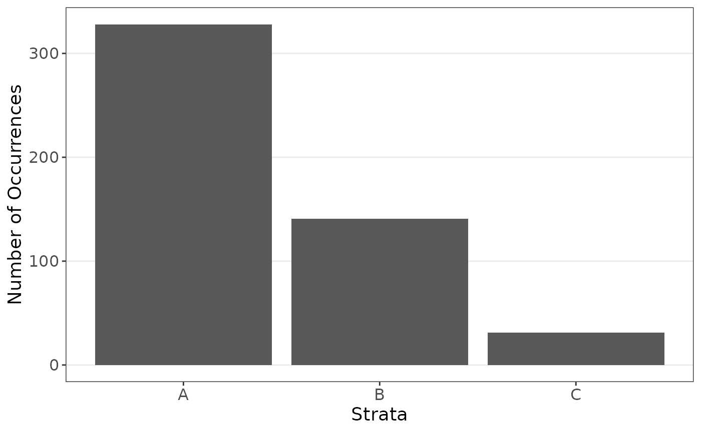
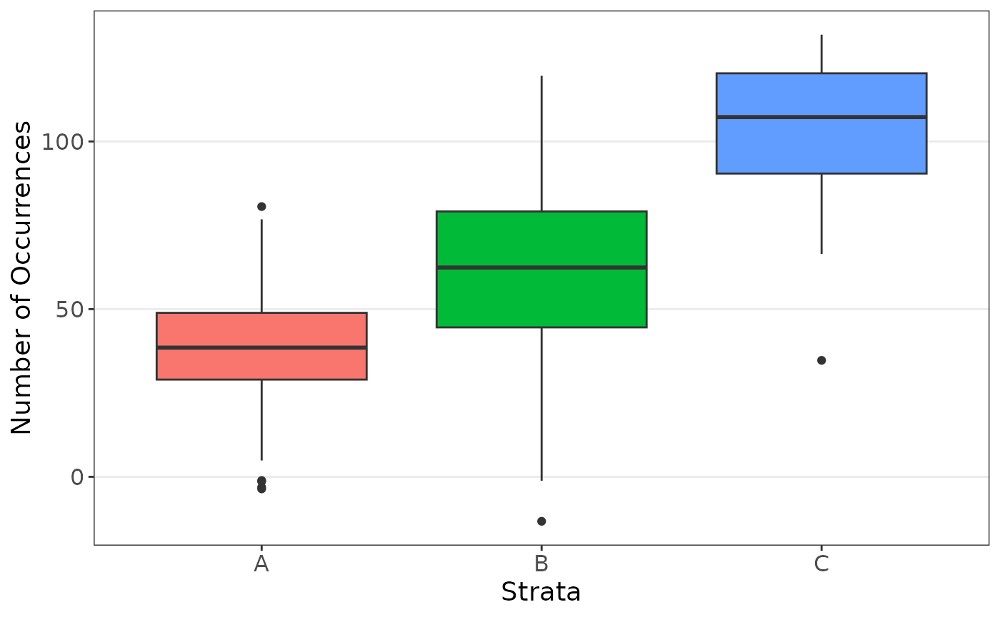

# purify

## Introduction

Welcome to \`purify’! This article will outline the main functions and
offer many valuable simulations for these functions. Real data examples
can be found in other articles.

\`Purify’ comes from its purpose of permutation tests and stratification
for data. It can be used to purify data and mitigate confounding
effects, particularly when looking at strata which are much smaller than
other strata.

The data can be found on GitHub and can be loaded as:

``` r

library(purify)
```

## Simulations

Let the data be generated as follows.

``` r

set.seed(1234)
n <- 500

data_strat <- data.frame(
  "y" = rep(NA, n),
  "x" = NA,
  "z" = sample(c("A", "B", "C"), size = n, replace = TRUE, prob = c(0.65, 0.3, 0.05)),
  "w" = rnorm(n, 75, 50)
)
data_strat[data_strat$z == "A", "x"] <- rnorm(length(data_strat[data_strat$z == "A", "x"]), 40, 15)
data_strat[data_strat$z == "B", "x"] <- rnorm(length(data_strat[data_strat$z == "B", "x"]), 60, 25)
data_strat[data_strat$z == "C", "x"] <- rnorm(length(data_strat[data_strat$z == "C", "x"]), 100, 25)

data_strat$y <- 10 + 0.1 * data_strat$x + rnorm(n, sd = 10)
```

We see a major inbalance is the groups.

``` r

plot_strata_bar(data_strat$z)
```



``` r

plot_strata_box(data_strat[, c("z", "x")])
```



Suppose we are interested in the following regression model.

``` r

strat_function <- function(X) {
  reg <- lm(y ~ x + z + w, data = X)

  coef(summary(reg))
}
```

The model on the original and resampled data can be computed.

``` r

set.seed(1234)
orig_coefs <- strat_function(data_strat)

set.seed(1234)
res <- resample(
  data = data_strat, fn = strat_function,
  strata = "z", sizes = function(x) round(mean(x))
)
```

The results show resampling improved the estimates.

``` r

orig_coefs
#>                Estimate  Std. Error   t value     Pr(>|t|)
#> (Intercept) 9.576796108 1.274266764 7.5155347 2.675532e-13
#> x           0.088091571 0.024632271 3.5762667 3.827606e-04
#> zB          1.349345740 1.145474836 1.1779794 2.393708e-01
#> zC          0.737367180 2.461056999 0.2996140 7.645974e-01
#> w           0.004762205 0.008959238 0.5315413 5.952822e-01
summarize_resample(res)
#>             estimates        sd         lower     upper
#> (Intercept) 4.3228401 3.8474942  5.638975e-15 10.610285
#> x           0.9374512 1.6308935  1.592706e-06  4.850056
#> zB          1.1009828 0.8988136 -2.103161e-01  3.289025
#> zC          1.0869065 1.2177640 -1.257088e+00  3.820084
#> w           0.4860588 0.8892172 -3.211363e-04  3.019224
```

## Titanic Example

From a subset of titanic data, it may be natural to try to estimate the
survival of a passenger.

``` r

# Define a custom function to calculate MSE
mse_function <- function(data) {
  pred <- as.numeric(predict(
    glm(as.factor(Survived) ~ .,
      data = data,
      family = binomial(link = "logit")
    ),
    type = "response"
  ) > 0.5)
  mean(as.numeric(data$Survived != pred))
}

# Simple resampling
set.seed(1234)
results <- resample(
  data = titanic, fn = mse_function,
  M = 1000, strata = "Pclass"
)
```

Resampling the data lead to lower mean squared error estimates.

``` r

# Does CV on each sample
#   Note, MSE uses all data while resample will be missing the CV part
#   See cats article for modifications
mse_function1 <- function(data) {
  cv <- cross_validation(
    data = data,
    pred_fn = function(data, nd) {
      as.numeric(predict(
        glm(as.factor(Survived) ~ .,
          data = data,
          family = binomial(link = "logit")
        ),
        type = "response", newdata = nd
      ))
    },
    error_fn = function(data, pred) {
      mean(as.numeric(data$Survived != pred))
    }
  )
  mod <- glm(as.factor(Survived) ~ .,
    data = data,
    family = binomial(link = "logit")
  )

  c(cv[[1]], as.numeric(coef(summary(mod))[, 1]))

  # mod <- lm(Hwt ~ ., data=data)
  # pred <- as.numeric(predict( mod , new_data=cv_data) )
  # c(mean((data$Hwt - pred)^2), as.numeric(coef(summary(mod))[,1]) )
}

set.seed(1234)
results <- resample(
  data = titanic, fn = mse_function,
  M = 1000, strata = "Pclass"
)

mse_function(titanic)
#> [1] 0.232902
summarize_resample(results)
#>    estimates         sd     lower     upper
#> V1 0.2264991 0.01908357 0.1903882 0.2643253
```

## German Credit Information

Below is a simple analysis of German credit data.

``` r

set.seed(1234)
# Define a custom function to calculate MSE
mse_function <- function(data) {
  pred <- unique(data$Class)[
    as.numeric(
      predict(
        glm(as.factor(Class) ~ .,
          data = data,
          family = binomial(link = "logit")
        ),
        type = "response"
      ) > 0.5
    ) + 1
  ]

  sum(as.numeric(data$Class != pred))
}

# Perform resampling with the 'simple' method
#   Note, MSE uses all data while resample will be missing the CV part
#   See cats article for modifications
results <- resample(
  data = credit, fn = mse_function,
  M = 2000, strata = "Job"
)
summarize_resample(results)
#>    estimates       sd lower upper
#> V1  591.2495 270.1585   194   811
mse_function(credit)
#> [1] 770
```
