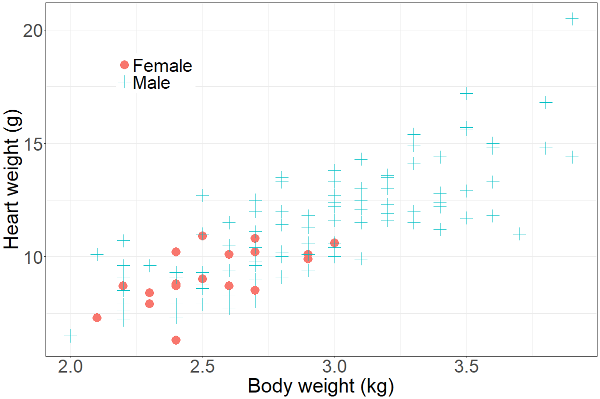

# Summary

`Purify` is an R package designed for resampling and testing of data, aimed at 
researchers and practitioners who analyze complex datasets with a potentially dependent output 
variable and multiple predictors. This package enables users to perform robust 
statistical analyses by allowing resampling of variables with and without relation
to the output variable. Analyses can be focused on results such as 
statistical summaries (e.g. mean square error) and coefficient estimates of models. 
`Purify` offers versatile resampling methods, including block, sliding window, 
and stratified resampling. These methods are also extended to cross-validation 
and prediction confidence intervals. Each can be tailored to specific data 
structures and research questions. With its intuitive interface and customizable options, 
`Purify` streamlines the process of hypothesis testing and estimation of 
statistical significance.

# Statement of need

Resampling is fundamental technique in estimating the distribution of a 
statistic, testing hypotheses, and deriving confidence intervals, especially 
when analytical solutions are impractical. Many R packages provide 
basic resampling methods but lack specialized support for complex structures.
Such structures may contain dependence and variables which should not be resampled.
Analysis of these structures can be unwieldy to investigate in other packages. 
`Purify` fills this gap by providing a flexible framework to enable data 
scientists and researchers to perform and compare targeted, customizable 
resampling schemes that account for data structure. Further, the methods allow 
for user-defined functions, allowing use of outside models, making `Purify` 
ideal for rigorous hypothesis testing and model evaluation. 

The package’s support for stratified and segmented sampling further allows users 
to address scenarios with grouped or ordered data (even under dependence), 
providing a critical resource for modern applied statistical research. By 
incorporating sophisticated resampling techniques, `Purify` enhances the 
robustness and reliability of statistical inferences drawn from complex 
(in particular unbalanced) datasets.

Permutation tests can be naturally computational intensive and speed is an 
important consideration throughout `Purify`. Users can use it in a variety of 
problems. Additional functions provide use of resampling in the context of
cross-validation. Supplemental functions provide visualizations and summary 
functions to illuminate the methods and results. Detailed documentation makes 
`Purify` accessible to users of varying statistical understanding.


{ width=100% }

# Package Functionality

A primary function in `Purify` is `resample()`. The function offers clear input parameters 
to simplify the process of selecting the correct methodology. The multistep selection allows for combinations of 
dependent data, unbalanced data, and resampling to be performed with and without 
replacement. The flexibility enables users to adapt `Purify` to diverse data 
contexts and hypothesis-testing requirements. See also `cross_validation()` and
`confidence_intervals()`.

Supporting functions such as `summarize_resample()` provide additional 
information to the user. Visualization such as `plot_strata_bar()` or 
`plot_strat_box()` visualize group sizes in stratified samples.


## Example

`Purify` provides several in-depth vignettes in the package or at its 
[website](https://jrvanderdoes.github.io/purify/). For example,

- The *purify* vignette describes the core features of `purify' 
  and includes simulations and real data examples to demonstrate the functions.
- The *cats* vignette details a case scenario on real data.

We consider a subset of the cats (*subcats*) data set below, where we use sex and body 
weight to estimate heart weight. See \autoref{fig:cats}. As seen in many real-world 
examples, the data is highly imbalanced. Nonetheless, sex and body weight are 
both useful in understanding heart weight. In particular, female cats have lower 
body weights and have a lower heart weight even for the same body weight when 
compared to male cats.


+-------------------+-----------------+----------------+----------------+
|                   | Intercept \     | Sex (M) \      | Body weight \  |
|                   | 95% Conf Int    | 95% Conf Int   | 95% Conf Int   |
+:=================:+:===============:+:==============:+:==============:+
| Single model      | -1.486 \        | 0.617 \        | 4.208 \        |
|                   | (-3.236, 0.264) | (-0.139, 1.372)| (3.573, 4.843) |
+-------------------+-----------------+----------------+----------------+
| Resampled model   | -0.214 \        | 0.900 \        | 4.155 \        |
|                   | (-3.060, 1.023) | (0.000, 3.886) | (0.000,14.283) |
+===================+=================+================+================+

: **Subcats models.** Models of cats using body weight and sex to predict heart weight.\label{tab:cats}


Let the linear model be defined as heart weight being predicted by a intercept,
body weight and sex. Estimates for the coefficients and the confidence intervals
for each parameter are given in \autoref{tab:cats}. When applying the linear 
model directly on the data, only body weights appear to significantly impact 
heart weight. For resampled data, where samples are taken to create more evenly
sized groups based on sex, both sex and body weight are determined to be 
significant. The cost for this simple example is that the confidence interval 
on body weight is much larger. While additional simulations, or modifying the 
resampling scheme could mitigate such losses, it is important to consider such 
effects. See vignettes for additional analysis on this and other data.

<!--
# ```{r setup, echo=FALSE}
# library(purify)
# library(ggplot2)
# ```
# 
# ```{r example_plot, echo=FALSE}
# png('./vignettes/cat_overview.png', width=1200, height=800)
# ggplot() +
#   geom_point(aes(x=Bwt, y=Hwt, col=Sex,shape = Sex),data=subcats, size=8) +
#   theme_bw() +
#   theme(axis.title = element_text(size=40),
#         axis.text = element_text(size=36),
#         legend.position = c(.2, .8),
#         legend.title = element_blank(),
#         legend.text = element_text(size=36)) +
#   scale_color_discrete(labels = c('Female', 'Male')) +
#   scale_shape_manual(labels = c('Female', 'Male'),
#                        values = c(16,3)) +
#   xlab('Body weight (kg)') +
#   ylab('Heart weight (g)')
# dev.off()
# ```
-->

<!--
```{r example}  
summ_function <- function(data) {
  coef(summary(lm(Hwt ~ ., data = data)))
}

set.seed(1234)
tmp <- lm(Hwt ~ ., data =subcats)
coef(summary(tmp))
confint(tmp)
summ_function(subcats)

# Perform resampling
results <- resample(data = subcats, fn = summ_function, M = 1000,
                             strata='Sex',sizes=mean)
summarize_resample(results, alpha=0.01)
```
-->

# Implementation

`Purify` is implemented in R, following standard stylization and using 
vectorized operations for efficient computation. The package's modular design 
and clear documentation make it easy to adapt to various research needs, 
allowing users to integrate their own statistical functions or modify resampling 
parameters to meet specific analytical requirements. `Purify` has been used 
in @tetui:etal:2022, @scsrubook, and @alexander:hall:chen:2024.


# Acknowledgements

Development of the `Purify` package was inspired by foundational methods in 
statistical resampling and permutation testing. Special thanks to the 
open-source R community for support and resources.

Contributions to `Purify` are welcome and notable recognition is given to all 
who raise awareness of deficiencies in the package via the GitHub repository.


# References

